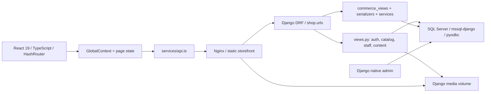

# Architecture audit

Audited application tree: `94d665881e3e929c41121d057385c28f822002fe`, 2026-09-10. See [the index](AUDIT_INDEX.md) for severity/status definitions, all hypotheses, and limits. Architecture observations below are maintenance debt, not proof that module size itself is a defect.

## System map

The active Git root is the nested `REZA-Formal/` directory. Parent archives and `patch/` are outside this repository and were not counted as production duplicates. There is no `.openai/hosting.json`. No service, deployed database, credential store, or persistent volume was modified.

| Boundary | Owner and responsibilities | Observed coupling |
| --- | --- | --- |
| Browser entry/routing | `index.html -> index.tsx -> App.tsx`; HashRouter, lazy feature routes, auth/staff guards | Public and staff screens share a catalog array and global provider |
| API adapter | `services/api.ts`, 1,009 lines; URL construction, CSRF, refresh, JSON errors, aliases and domain normalization | UI types in `types.ts` are asserted from unchecked responses; no generated schema |
| UI state | `GlobalContext.tsx`, 447 lines; account, catalog, settings, cart, wishlist, theme, overlays/toasts | Server records and presentation state have the same subscription boundary |
| Core Django app | `models.py` (707 lines), `views.py` (963), `serializers.py` | Product inventory/media logic remains inside views; legacy order classes remain importable |
| Commerce | `commerce_services.py` (818), `commerce_views.py` (709), `commerce_serializers.py` | Services own checkout/lifecycle transactions; views still own cart, return creation and address transactions |
| Persistence | SQL Server normally; SQLite only under `test_settings` | Product stock is a projection on most commerce paths but also an input on default-variant paths |
| Admin | React `AdminPanel`, API `/api/admin/*`, native Django `/admin/` | Native model forms bypass services; frontend role and API staff rules differ |
| Operations | Compose, Gunicorn (3 workers), Nginx, local media/static volumes, health endpoints | Startup may create DB, migrate, collectstatic and seed; no outbox worker or provider adapter |

## End-to-end workflow traces

| Workflow | Frontend -> endpoint -> backend/persistence -> result | Boundaries and failures |
| --- | --- | --- |
| Authentication hydration | GlobalProvider mount -> `api.me` -> cookie/header JWT -> `serialize_user` -> user state; then catalog/settings | Initial catalog call retains the pre-hydration closure (FE-001). ProtectedRoute waits for `isAuthLoading`, not catalog loading |
| Login/register/logout | AuthModal -> API CSRF bootstrap -> register/login -> normalized unique email, password validation/authentication -> HttpOnly cookies; logout clears cookies | No server session revocation (SEC-002). OTP enrollment and Google UI are disabled; Google backend is routed |
| Catalog/detail | Context -> public/admin products -> ProductSerializer with variants/reviews; ProductPage separately loads detail and reviews | Public queries filter active products, not variants. Two aggregate queries per product; overlapping detail responses can replace newer state |
| Product administration | AdminPanel file/variant form -> multipart admin product upsert -> prepare_product_data, serializer, _sync_product_variants -> stock/movements | Gallery writes precede DB validation; UI sends Data URLs. Public detail mutation route and native admin also write products |
| Cart | Guest localStorage -> context lines; after login GET saved cart -> merge by variant key/max quantity -> PUT replacement -> user-locked SavedCartItem replacement | No reservation until checkout; client hydration, debounce and identity changes can race (FE-004) |
| Wishlist | Local IDs -> authenticated GET -> union/POST missing IDs; toggle -> POST/DELETE -> user-product unique row | Local storage is not account scoped; requests have no generation/cancellation guard |
| Quote/checkout | CartPage -> options/addresses -> debounced quote -> validated items -> Decimal product/variant prices, coupon rules, shipping; create -> same calculation with locks | Create uses supplied UUID or generates one, creates Order/OrderItems/Payment/InventoryMovement/Event/Outbox and removes purchased saved-cart lines in one transaction |
| Orders/cancellation | Profile lists/details -> owner-scoped commerce endpoints; pending customer cancel or staff pending/processing cancel -> locked service | Stock restoration is guarded against repeats; paid/partially refunded payment blocks cancellation. Order payment projection is stale after cancel (BE-006) |
| Payment/fulfillment | Admin API status update -> transition_payment/transition_order_status | Manual payment must be paid before shipping; COD becomes paid at delivery. Online method returns 503 before writes. Native admin bypasses this contract |
| Returns/refunds | Delivered owned order -> item IDs/remaining quantities checked under order lock -> one ReturnRequest per item -> approve/receive/refund service | Receiving restocks once; refund calculation ignores allocated discounts. Manual partial refund has no amount. Multi-item create returns only first request plus combined item IDs |
| Reviews | ProductPage -> delivered purchase check -> pending verified review; staff moderation -> approved public page | User-product unique and rating range protected; display is first page only |
| Other staff work | AdminPanel -> stats/orders/users/messages plus coupons/shipping/payments/reviews/returns/bespoke capabilities | Old lists unbounded; commerce lists capped at 25 by default but UI ignores later pages |
| Content/leads | Settings form -> validated ImageFields/clear flags; contact/bespoke/newsletter -> records, sometimes outbox | Newsletter unique serializer prevents repeat/reactivation. Outbox persists intentions but no delivery worker exists |
| Deployment | Compose SQL health -> backend startup scripts -> readiness query -> frontend readiness through Nginx | Development topology is not evidence of a production deployment or restored backups |

## State and contract authority

The database is authoritative for prices, stock, order ownership, fulfillment and payment records. Browser quantity checks and totals are advisory. The actual API is defined jointly by `shop/urls.py`, endpoint serializers/views and `frontend/services/api.ts`; `frontend/types.ts` describes UI shapes, not validated wire DTOs. There is no checked-in OpenAPI contract or contract generation step.

Guest cart and wishlist are browser owned until account synchronization. Catalog, settings and account records are copies of server state, with duplicated page-level copies. `services/db.ts` is a live read-only fallback, not a second order/payment backend. It removes retired local account/order/message/settings keys and never reports fake successful writes.

Order item, address, coupon and shipping snapshots preserve most history after catalog deletion. Current customer email/name fallback and event actor names still resolve live user records. Payment and return records are real offline bookkeeping; external transfer/delivery integrations are absent by design.

## ARCH-001 - GlobalContext couples unrelated state domains

| Attribute | Audit record |
| --- | --- |
| ID | ARCH-001 |
| Severity | P2 |
| Confidence | High |
| Status | Open - maintenance debt |
| Evidence | Static ownership inventory and 447-line provider; ProductCard consumes the same context for addToCart as auth and toast consumers. |
| File/function references | frontend/contexts/GlobalContext.tsx:97,146,192,407; frontend/components/ProductCard.tsx:11 |
| Current behaviour | A fresh provider value and action functions combine authentication, catalog, cart, wishlist, settings, theme and notifications. |
| Impact | Any value change invalidates all context consumers; ownership and hydration fixes cross unrelated domains. No measured rendering latency is claimed. |
| Reproduction/proof | Static ownership inventory and 447-line provider; ProductCard consumes the same context for addToCart as auth and toast consumers. |
| Root cause | Single provider is both server cache and UI state container. |
| Remediation recommendation | Separate domains after correctness coverage; define guest/account merge ownership and explicit query invalidation before choosing a state library. |
| Regression testing needed | Auth/cart/wishlist transitions and render profiling on a representative catalog; preserve RTL and offline behavior. |
| Dependencies | FE-001, FE-004, TEST-001 |
| Migration implications | None expected for a client state split. |
| Recommended remediation batch | 6 |

## ARCH-002 - AdminPanel combines unrelated administration features

| Attribute | Audit record |
| --- | --- |
| ID | ARCH-002 |
| Severity | P2 |
| Confidence | High |
| Status | Open - maintenance debt |
| Evidence | Static source count; loadCommerceData invokes seven requests and runCommerceAction reloads all seven. |
| File/function references | frontend/pages/AdminPanel.tsx:25,109,140,498 |
| Current behaviour | One 1,433-line component contains 34 useState calls, six main tabs, seven commerce sections, forms, modals, filtering, printing and network orchestration. |
| Impact | Changes have a broad review surface; failures in unrelated requests complicate the selected feature. Size alone is not a functional defect. |
| Reproduction/proof | Static source count; loadCommerceData invokes seven requests and runCommerceAction reloads all seven. |
| Root cause | Feature responsibilities and data loading accumulated in one component. |
| Remediation recommendation | Extract feature screens/forms and shared table/dialog primitives after API behavior is pinned; preserve staff capabilities. |
| Regression testing needed | Staff workflows, pagination, form preservation on errors, keyboard/modal behavior. |
| Dependencies | FE-002, FE-005, TEST-001 |
| Migration implications | None expected. |
| Recommended remediation batch | 7 |

## ARCH-003 - API contracts depend on model-wide fields and duplicate adapters

| Attribute | Audit record |
| --- | --- |
| ID | ARCH-003 |
| Severity | P2 |
| Confidence | High |
| Status | Open - maintenance debt |
| Evidence | Inspected Meta.fields and read_only_fields: contact protects read/created_at; active commerce OrderSerializer uses an explicit field list. |
| File/function references | backend/shop/serializers.py:31,82,111,128,135; backend/shop/commerce_serializers.py:53,73,219; frontend/services/api.ts:123,154; frontend/types.ts |
| Current behaviour | Product, legacy Order, ContactMessage and SiteSettings serializers use fields='__all__'. Variant serializers expose different active/attributes shapes; user normalization also exists in context. |
| Impact | New model fields can silently expand a public/write contract. No current password/token disclosure through these serializers was found. |
| Reproduction/proof | Inspected Meta.fields and read_only_fields: contact protects read/created_at; active commerce OrderSerializer uses an explicit field list. |
| Root cause | Model evolution doubles as API evolution; legacy and new contracts coexist without a machine-checked wire schema. |
| Remediation recommendation | Declare explicit public/staff input/output fields; consolidate adapters with characterization coverage and document compatible aliases. |
| Regression testing needed | Response key snapshots, writable-field denial tests, serializer/API/UI alias tests. |
| Dependencies | ARCH-004, TEST-001, TEST-002 |
| Migration implications | Usually no DB migration; API compatibility and rollout required. |
| Recommended remediation batch | 4 |
